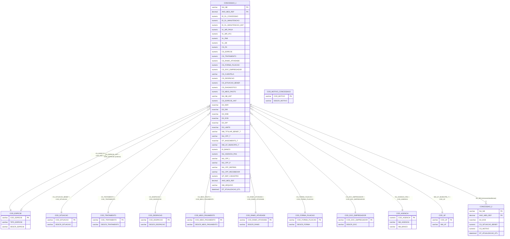

# Modelo ER — CONCESSAO_1
**Base:** BD_BENEFICIOS_HIST.dbo.CONCESSAO_1

## Notas
- **CONCESSAO_1 ↔ CONCESSAO_3**: Mesmo schema (128 campos). CON1 e CON3 são partições horizontais do mesmo layout — provavelmente cargas de períodos distintos.
- **CONCESSAO_1 ↔ CONCESSAO_2**: CONCESSAO_2 é tabela complementar de cessação/atualização, ligada por NU_NB. Registra D2_DCB, CS_MOTIVO e nova CS_SITUACAO_BENEF quando o benefício é encerrado ou alterado.
- Datas D2_* em nvarchar(20) no formato **DDMMAAAA** — exigem SUBSTRING para conversão.
