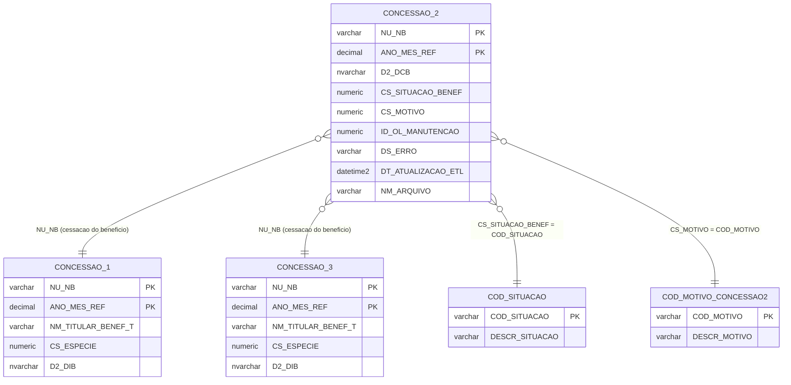

# Modelo ER — CONCESSAO_2
**Base:** BD_BENEFICIOS_HIST.dbo.CONCESSAO_2

## Notas
- CONCESSAO_2 é a **tabela de eventos de cessação**. Um NU_NB pode ter múltiplos registros em diferentes competências caso seja cessado, reativado e cessado novamente.
- O campo CS_MOTIVO referencia COD_MOTIVO_CONCESSAO2 — tabela exclusiva desta funcionalidade com 99 códigos de motivo de encerramento/alteração.
- A relação com CONCESSAO_1 e CONCESSAO_3 é pelo NU_NB — não há chave estrangeira física no banco.
