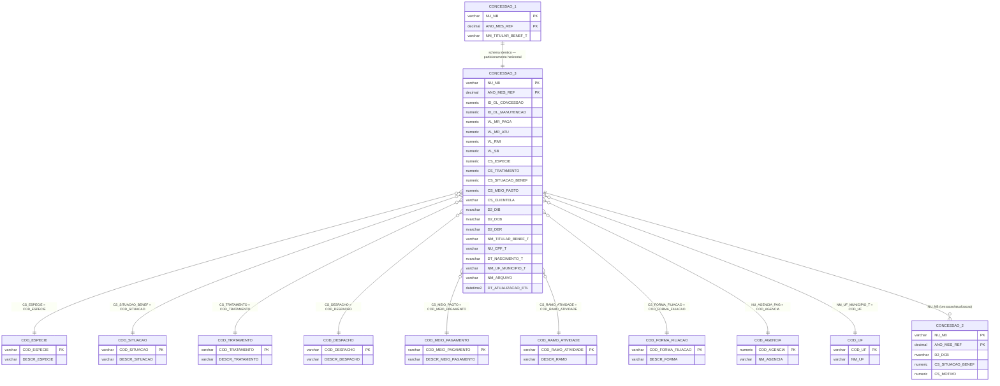

# Modelo ER — CONCESSAO_3
**Base:** BD_BENEFICIOS_HIST.dbo.CONCESSAO_3

## Notas
- CONCESSAO_3 é **logicamente equivalente** a CONCESSAO_1 — mesmo schema de 128 campos.
- O particionamento (CON1 / CON3) é físico/operacional, provavelmente por período ou por código de espécie.
- Para análises que requerem toda a base de concessões, deve-se fazer `UNION ALL` entre CONCESSAO_1 e CONCESSAO_3.
