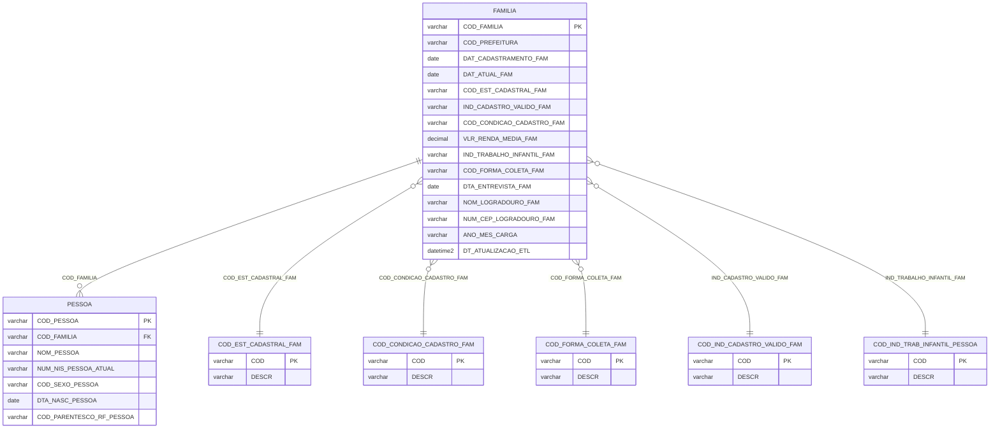

# Modelo ER - FAMILIA

```mermaid
erDiagram
    FAMILIA {
        varchar COD_FAMILIA PK
        varchar COD_PREFEITURA
        date DAT_CADASTRAMENTO_FAM
        date DAT_ATUAL_FAM
        varchar COD_EST_CADASTRAL_FAM
        varchar IND_CADASTRO_VALIDO_FAM
        varchar COD_CONDICAO_CADASTRO_FAM
        decimal VLR_RENDA_MEDIA_FAM
        varchar IND_TRABALHO_INFANTIL_FAM
        varchar COD_FORMA_COLETA_FAM
        date DTA_ENTREVISTA_FAM
        varchar NOM_LOGRADOURO_FAM
        varchar NUM_CEP_LOGRADOURO_FAM
        varchar ANO_MES_CARGA
        datetime2 DT_ATUALIZACAO_ETL
    }

    PESSOA {
        varchar COD_PESSOA PK
        varchar COD_FAMILIA FK
        varchar NOM_PESSOA
        varchar NUM_NIS_PESSOA_ATUAL
        varchar COD_SEXO_PESSOA
        date DTA_NASC_PESSOA
        varchar COD_PARENTESCO_RF_PESSOA
    }

    COD_EST_CADASTRAL_FAM {
        varchar COD PK
        varchar DESCR
    }

    COD_CONDICAO_CADASTRO_FAM {
        varchar COD PK
        varchar DESCR
    }

    COD_FORMA_COLETA_FAM {
        varchar COD PK
        varchar DESCR
    }

    COD_IND_CADASTRO_VALIDO_FAM {
        varchar COD PK
        varchar DESCR
    }

    COD_IND_TRAB_INFANTIL_PESSOA {
        varchar COD PK
        varchar DESCR
    }

    FAMILIA ||--o{ PESSOA : "COD_FAMILIA"
    FAMILIA }o--|| COD_EST_CADASTRAL_FAM : "COD_EST_CADASTRAL_FAM"
    FAMILIA }o--|| COD_CONDICAO_CADASTRO_FAM : "COD_CONDICAO_CADASTRO_FAM"
    FAMILIA }o--|| COD_FORMA_COLETA_FAM : "COD_FORMA_COLETA_FAM"
    FAMILIA }o--|| COD_IND_CADASTRO_VALIDO_FAM : "IND_CADASTRO_VALIDO_FAM"
    FAMILIA }o--|| COD_IND_TRAB_INFANTIL_PESSOA : "IND_TRABALHO_INFANTIL_FAM"
```
