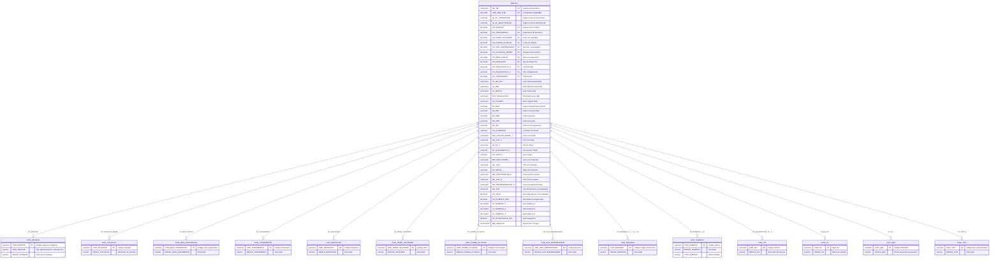

```mermaid
erDiagram
    MACICA {
        varchar10    NU_NB              PK "Número do Benefício"
        decimal6     ANO_MES_REF        PK "Competência AAAAMM"
        varchar8     ID_OL_CONCESSAO       "Órgão Local de Concessão"
        varchar8     ID_OL_MANUTENCAO      "Órgão Local de Manutenção"
        decimal2     CS_ESPECIE         FK "Espécie do benefício"
        decimal2     CS_TRATAMENTO      FK "Tratamento do benefício"
        decimal1     CS_RAMO_ATIVIDADE  FK "Ramo de atividade"
        decimal1     CS_FORMA_FILIACAO  FK "Forma de filiação"
        decimal1     CS_DOC_EMPREGADOR  FK "Tipo doc. empregador"
        decimal2     CS_SITUACAO_BENEF  FK "Situação do benefício"
        decimal2     CS_MEIO_PAGTO      FK "Meio de pagamento"
        decimal2     CS_DESPACHO        FK "Tipo de despacho"
        varchar6     CS_DIAGNOSTICO_N   FK "CID principal"
        varchar6     CS_DIAGNOSTICO_1   FK "CID complementar"
        decimal2     CS_TRATAMENTO      FK "Tratamento"
        varchar14    VL_MR_ATU             "Valor Renda Atual (R$)"
        varchar14    VL_RMI                "Valor Renda Inicial (R$)"
        varchar14    VL_BRUTO              "Valor Bruto (R$)"
        varchar14    TOT_DESCONTOS         "Total Descontos (R$)"
        varchar14    VL_LIQUIDO            "Valor Líquido (R$)"
        varchar8     D2_DER                "Data Entrada Requerimento"
        varchar8     D2_DIB                "Data Início Benefício"
        varchar8     D2_DDB                "Data Despacho"
        varchar8     D2_DCB                "Data Cessação"
        varchar8     D2_DIP                "Data Início Pagamento"
        varchar1     CS_CLIENTELA          "U=Urbano R=Rural"
        varchar40    NM_TITULAR_BENEF_T    "Nome do Titular"
        varchar11    NU_CPF_T              "CPF do Titular"
        varchar11    ID_NIT_T              "NIT do Titular"
        varchar8     DT_NASCIMENTO_T       "Nascimento Titular"
        varchar2     CS_SEXO_T             "Sexo Titular"
        varchar40    NM_INSTITUIDOR_I      "Nome do Instituidor"
        varchar11    NU_CPF_I              "CPF do Instituidor"
        varchar8     D2_OBITO_I            "Óbito do Instituidor"
        varchar70    NM_PROCURADOR_P       "Nome do Procurador"
        varchar11    NU_CPF_P              "CPF do Procurador"
        varchar40    NM_REPRESENTANTE_R    "Nome do Representante"
        varchar11    NU_CPF                "CPF Beneficiário (consolidado)"
        decimal1     CS_SEXO               "Sexo Beneficiário (consolidado)"
        decimal3     QT_RUBRICA_REG        "Qtd Rubricas Registradas"
        decimal14    VL_RUBRICA_1          "Valor Rubrica 1"
        decimal14    VL_RUBRICA_2          "Valor Rubrica 2"
        decimal14    VL_RUBRICA_3          "Valor Rubrica 3"
        datetime     DT_ATUALIZACAO_ETL    "Data Carga ETL"
        varchar256   NM_ARQUIVO            "Arquivo ETL Origem"
    }

    COD_ESPECIE {
        varchar2    COD_ESPECIE      PK "Código espécie (2 dígitos)"
        varchar     TIPO_ESPECIE        "Tipo (Aposentadoria, Pensão etc.)"
        varchar     DESCR_ESPECIE       "Descrição completa"
    }

    COD_SITUACAO {
        varchar2    COD_SITUACAO     PK "Código situação"
        varchar     DESCR_SITUACAO      "Descrição da situação"
    }

    COD_MEIO_PAGAMENTO {
        varchar2    COD_MEIO_PAGAMENTO  PK "Código meio pagamento"
        varchar     DESCR_MEIO_PAGAMENTO   "Descrição"
    }

    COD_TRATAMENTO {
        varchar2    COD_TRATAMENTO   PK "Código tratamento"
        varchar     DESCR_TRATAMENTO    "Descrição"
    }

    COD_DESPACHO {
        varchar2    COD_DESPACHO     PK "Código despacho"
        varchar     DESCR_DESPACHO      "Descrição"
    }

    COD_RAMO_ATIVIDADE {
        varchar2    COD_RAMO_ATIVIDADE  PK "Código ramo"
        varchar     DESCR_ATIVIDADE        "Descrição"
    }

    COD_FORMA_FILIACAO {
        varchar1    COD_FORMA_FILIACAO  PK "Código forma filiação"
        varchar     DESCR_FORMA_FILIACAO   "Descrição"
    }

    COD_DOC_EMPREGADOR {
        varchar1    COD_DOC_EMPREGADOR  PK "Código tipo doc"
        varchar     DESCR_DOC_EMPREGADOR   "Descrição"
    }

    COD_EMISSOR {
        varchar2    COD_EMISSOR      PK "Código órgão emissor RG"
        varchar     DESCR_EMISSOR       "Descrição"
    }

    COD_RUBRICA {
        varchar3    COD_RUBRICA      PK "Código rubrica"
        varchar     DESCR_RUBRICA       "Descrição"
        varchar     TIPO_RUBRICA        "Débito/Crédito"
    }

    COD_CID {
        varchar6    COD_CID          PK "Código CID-10"
        varchar     DESCR_CID           "Descrição da doença"
    }

    COD_UF {
        varchar2    COD_UF           PK "Sigla UF"
        varchar     DESCR_UF            "Nome do estado"
    }

    COD_GEX {
        varchar8    COD_GEX          PK "Código GEX/APS"
        varchar     DESCR_GEX           "Nome da gerência executiva"
    }

    COD_TIPO {
        varchar2    COD_TIPO         PK "Código tipo representante"
        varchar     DESCR_TIPO          "Descrição"
    }

    MACICA ||--o{ COD_ESPECIE          : "CS_ESPECIE"
    MACICA ||--o{ COD_SITUACAO         : "CS_SITUACAO_BENEF"
    MACICA ||--o{ COD_MEIO_PAGAMENTO   : "CS_MEIO_PAGTO"
    MACICA ||--o{ COD_TRATAMENTO       : "CS_TRATAMENTO"
    MACICA ||--o{ COD_DESPACHO         : "CS_DESPACHO"
    MACICA ||--o{ COD_RAMO_ATIVIDADE   : "CS_RAMO_ATIVIDADE"
    MACICA ||--o{ COD_FORMA_FILIACAO   : "CS_FORMA_FILIACAO"
    MACICA ||--o{ COD_DOC_EMPREGADOR   : "CS_DOC_EMPREGADOR"
    MACICA ||--o{ COD_EMISSOR          : "CS_EMISSOR_T / _I / _P / _R"
    MACICA ||--o{ COD_RUBRICA          : "CS_RUBRICA_1..10"
    MACICA ||--o{ COD_CID              : "CS_DIAGNOSTICO_N / _1"
    MACICA ||--o{ COD_UF               : "campos _UF_*"
    MACICA ||--o{ COD_GEX              : "ID_OL_*"
    MACICA ||--o{ COD_TIPO             : "CS_TIPO_R"
```
