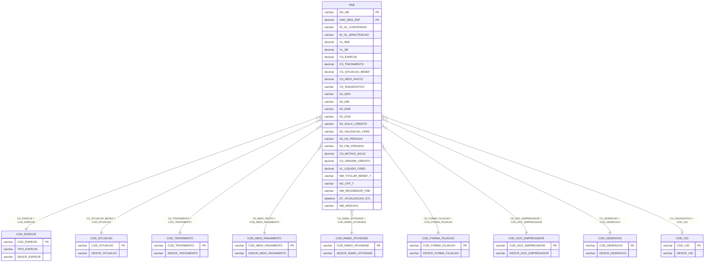

# Modelo ER — PAB
**Base:** BD_BENEFICIOS_HIST.dbo.PAB

## Notas
- O bloco `D2_SOLIC_CREDITO`, `NU_SEQ_SOLIC_CRED`, `D2_VALIDACAO_CRED`, `D2_INI_PERIODO`, `D2_FIM_PERIODO`, `CS_MOTIVO_SOLIC`, `CS_ORIGEM_CREDITO` e `VL_LIQUIDO_CRED` caracteriza o evento financeiro específico do PAB.
- O restante do layout preserva os dados cadastrais do benefício, semelhantes às tabelas de concessão, para contextualizar o crédito.
- Datas `D2_*` seguem o padrão `DDMMAAAA` em `varchar(8)`.
