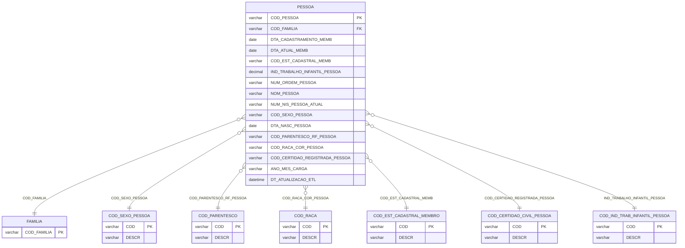

# Modelo ER - PESSOA

```mermaid
erDiagram
    PESSOA {
        varchar COD_PESSOA PK
        varchar COD_FAMILIA FK
        date DTA_CADASTRAMENTO_MEMB
        date DTA_ATUAL_MEMB
        varchar COD_EST_CADASTRAL_MEMB
        decimal IND_TRABALHO_INFANTIL_PESSOA
        varchar NUM_ORDEM_PESSOA
        varchar NOM_PESSOA
        varchar NUM_NIS_PESSOA_ATUAL
        varchar COD_SEXO_PESSOA
        date DTA_NASC_PESSOA
        varchar COD_PARENTESCO_RF_PESSOA
        varchar COD_RACA_COR_PESSOA
        varchar COD_CERTIDAO_REGISTRADA_PESSOA
        varchar ANO_MES_CARGA
        datetime DT_ATUALIZACAO_ETL
    }

    FAMILIA {
        varchar COD_FAMILIA PK
    }

    COD_SEXO_PESSOA {
        varchar COD PK
        varchar DESCR
    }

    COD_PARENTESCO {
        varchar COD PK
        varchar DESCR
    }

    COD_RACA {
        varchar COD PK
        varchar DESCR
    }

    COD_EST_CADASTRAL_MEMBRO {
        varchar COD PK
        varchar DESCR
    }

    COD_CERTIDAO_CIVIL_PESSOA {
        varchar COD PK
        varchar DESCR
    }

    COD_IND_TRAB_INFANTIL_PESSOA {
        varchar COD PK
        varchar DESCR
    }

    PESSOA }o--|| FAMILIA : "COD_FAMILIA"
    PESSOA }o--|| COD_SEXO_PESSOA : "COD_SEXO_PESSOA"
    PESSOA }o--|| COD_PARENTESCO : "COD_PARENTESCO_RF_PESSOA"
    PESSOA }o--|| COD_RACA : "COD_RACA_COR_PESSOA"
    PESSOA }o--|| COD_EST_CADASTRAL_MEMBRO : "COD_EST_CADASTRAL_MEMB"
    PESSOA }o--|| COD_CERTIDAO_CIVIL_PESSOA : "COD_CERTIDAO_REGISTRADA_PESSOA"
    PESSOA }o--|| COD_IND_TRAB_INFANTIL_PESSOA : "IND_TRABALHO_INFANTIL_PESSOA"
```
