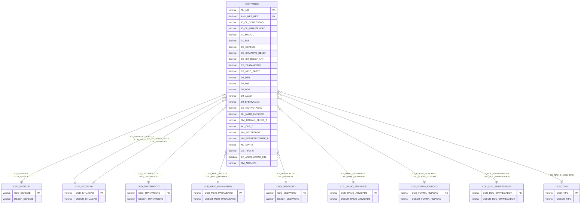

# Modelo ER — REATIVADOS
**Base:** BD_BENEFICIOS_HIST.dbo.REATIVADOS

## Notas
- O bloco `D2_EFETIVACAO`, `D2_ACAO`, `NU_MATR_EMISSOR`, `CS_MOTIVO_ACAO` e `CS_SIT_BENEF_ANT` caracteriza o evento de reativação.
- `CS_TIPO_R` sugere relacionamento com `COD_TIPO`, que possui dois valores e se ajusta ao papel do representante.
- `D2_EFETIVACAO` apareceu na amostra com 6 posições (`MMYYYY`), diferente das demais datas `D2_*` em `DDMMAAAA`.
